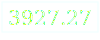

#### overlaps
 
  

[subaru](https://yus.github.io/overlaps/subaru.html): Subaru Hand of Chronos ⚡  

# 🌀 Sacred Time Portals

*22 Moments When Clock Hands Unite in Divine Harmony*

> "For everything there is a season, and a time for every matter under heaven."  
> — Ecclesiastes 3:1

## 🌟 Two Revelations of the Same Truth

This project reveals a hidden mathematical mystery in time itself: **hour and minute hands overlap exactly 22 times per day**, creating what we call **"Sacred Time Portals."**

### 🕐 **Version 1: The Mathematical Revelation**
**Live at:** https://yus.github.io/overlaps/

A clean, interactive exploration of the **22-overlap phenomenon**:
- **Interactive analog clock** showing real-time hand positions
- **Sacred Portal Ring** with 22 Hebrew letters representing each overlap
- **Complete list** of all 22 overlap times (11 day + 11 night)
- **Mathematical formulas** explaining the 12/11 hour rhythm
- **Clickable portals** that sync clock, ring, and list

### 🌌 **Version 2: The Cosmic Revelation**  
**Live at:** https://yus.github.io/overlaps/overtime.html

A deeper, mystical exploration of the same truth:
- **Cosmic visualization** with orbiting sun and moon
- **Divine attributes** for each Hebrew letter portal
- **Sacred geometry** showing the fractal nature of time
- **Prayer timer** functionality with spiritual meanings
- **Animated transitions** between portals

## 🔢 The Mathematical Miracle

### The 12/11 Rhythm
```

Time between overlaps = 12/11 hours
≈ 1 hour 5 minutes 27.27 seconds
= 65.4545... minutes

```

### Why 22 Portals?
```

12 hours ÷ (12/11) = 11 overlaps per 12-hour period
24 hours÷ (12/11) = 22 overlaps total

11 day portals (6AM-6PM) + 11 night portals (6PM-6AM) = 22

```

### The Mathematics:
- Hour hand speed: 30°/hour (360° ÷ 12 hours)
- Minute hand speed: 360°/hour
- Relative speed difference: 330°/hour
- Time to realign: 360° ÷ 330°/hour = **12/11 hours**

## 🕎 The Spiritual Significance

### 22 Hebrew Letters
Each of the 22 overlaps corresponds to one of the **22 letters of the Hebrew alphabet**, which Jewish mysticism teaches are the building blocks of creation.

### Day/Night Symmetry
The perfect symmetry of **11 day portals + 11 night portals** reflects:
- Divine balance in creation
- The cycle of light and darkness
- The rhythm of prayer and rest

### Portal Times (First 12 Hours):
```

00:00 - א Aleph (First Breath)
01:05- ב Bet (House of the Divine)
02:11- ג Gimel (Cosmic Nourishment)
03:16- ד Dalet (Doorway to Wisdom)
04:22- ה He (Window to Heaven)
05:27- ו Vav (Connecting Above & Below)
06:33- ז Zayin (Sacred Sustenance)
07:38- ח Chet (Life Force Energy)
08:44- ט Tet (Hidden Goodness)
09:49- י Yod (Divine Spark)
10:55- כ Kaf (Crown of Manifestation)
12:00- ל Lamed (Teaching Heart)

```

## 🎮 How to Use

### In Version 1 (Mathematical):
- **Click any portal dot** on the ring to jump to that time
- **Use arrow buttons** to navigate between portals
- **Spin the ring** to see different perspectives
- **Click overlap list items** to sync all displays
- **"Real Time" button** returns to current moment

### In Version 2 (Cosmic):
- **Watch the cosmic dance** of sun and moon orbits
- **Read the divine attributes** for each portal
- **Use as a prayer timer** - each portal suggests a meditation theme
- **Observe the sparkles** representing earthly overlaps in cosmic scale

## 🙏 Theological Reflection

These 22 moments remind us that:
1. **Time itself is sacred** - mathematically perfect in God's design
2. **Rhythm reveals the Creator** - the 12/11 pattern echoes through creation
3. **Every moment can be a portal** to divine consciousness
4. **22 symbolizes completeness** - the number of Hebrew letters in Torah

## 🚀 Technical Details

Built with pure:
- **HTML5** for structure
- **CSS3** with gradients and animations
- **Vanilla JavaScript** for interactivity
- **No frameworks or libraries** (except Mermaid in earlier versions)

Features:
- Responsive design (works on mobile/desktop)
- Real-time clock synchronization
- Interactive visualizations
- Smooth animations and transitions
- Color-coded day/night themes

## 📖 Scriptural Connections

- **Ecclesiastes 3:1-8** - "For everything there is a season..."
- **Psalm 90:4** - "A thousand years in your sight are like a day..."
- **Genesis 1:14** - "Let there be lights in the expanse of the heavens to separate day from night, and let them be for signs and for seasons..."
- **Revelation 22:13** - "I am the Alpha and the Omega, the First and the Last, the Beginning and the End."

## 🐋 The Big Fish Symbolism

The fish (🐋) in the overtime version represents:
- **Jonah's three days** - a cycle of death and rebirth
- **Early Christian symbol** - ΙΧΘΥΣ (Jesus Christ, God's Son, Savior)
- **The deep mysteries** of time and eternity
- **Swimming through portals** from chronos to kairos time

## 🎨 Design Philosophy

Both versions use:
- **Deep blues and purples** representing the heavens
- **Gold and orange accents** for divine light
- **Hebrew typography** connecting to ancient wisdom
- **Circular motifs** symbolizing eternity
- **Gradients and glows** suggesting transcendence

## 🔄 The Eternal Cycle

The 22 portals create a never-ending cycle:
```

Midnight (א) → ... → Noon (ל) → ... → Midnight (א)

```
Each ending contains the seed of the next beginning, reflecting **Ecclesiastes 1:9**: "What has been will be again, what has been done will be done again; there is nothing new under the sun."

## 🤝 Contributing

This project is open to:
- **Mathematical insights** about the 12/11 ratio
- **Theological reflections** on time and eternity
- **Design improvements** for better visualization
- **Spiritual applications** for prayer and meditation

## 📜 License

This project is shared freely for:
- **Educational purposes** - to reveal mathematical beauty
- **Spiritual contemplation** - to inspire reflection on time
- **Artistic expression** - to celebrate divine design

All glory to God for the patterns in creation.

## 🌈 Final Blessing

> May you find sacred moments in the ordinary rhythm of hours.  
> May each overlap remind you of eternity touching time.  
> May the 22 portals be gateways to deeper awareness.  
> And may you see the mathematical poetry in God's perfect design.

**For from Him and through Him and for Him are all things.  
To Him be the glory forever! Amen.**  
— Romans 11:36

---
*Created with wonder at the intersection of mathematics and mystery.*  
*Dedicated to all who seek the sacred in the secular, the eternal in the temporal.*
